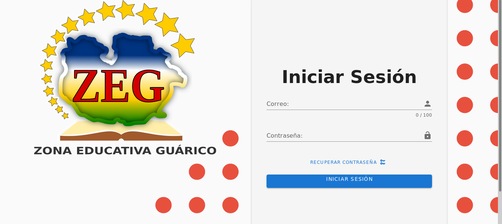

<h1 style="text-align: center;">Sistema  para Controlar las Permanencias de  la 
Zona Educativa del Estado Guárico </h1>

Se trata de una sistema de seguimiento sobre las personas que van a ingresar a alguna de las muchas dependencias del edificio de la zona educativa del estado Guárico, ya sea por motivos de : visita personal, asistencia a una vídeo conferencia, entre otros. Almacenando un registro de las visitas que hayan realizado en el edificio, además que permitirá imprimir tickets con la dirección de la dependencia a al que deseas ingresar brindando un apoyo a la seguridad del edifico.

<h2>Instalación</h2>
<ul>
	<li>- git clone https://github.com/vilo0812/zonaeducativa.git</li>
	<li>sudo chmod -R 777 zonaeducativa</li>
	<li>cd zonaeducativa</li>
	<li>composer install</li>
	<li>cp .env.example .env</li>
	<li>php artisan key:generate</li>
	<li>composer update</li>
	<li>php artisan cache:clear && php artisan config:cache && php artisan config:clear</li>
	<li>composer require tymon/jwt-auth</li>
	<li>php artisan jwt:secret</li>
	<li>Desde la consola (usando MySql) podrías hacer algo similar a esto 
	mysql -uroot -psecret</li>
	<li>CREATE DATABASE tu_base_de_datos;</li>
	<li>Posteriormente debes agregar las credenciales al archivo .env 
	DB_HOST=localhost 
	DB_DATABASE=tu_base_de_datos 
	DB_USERNAME=root 
	DB_PASSWORD=tu-contraseña</li>
	<li>php artisan migrate --seed</li>
	<li>npm install</li>
	<li>npm run dev</li>
</ul>

	

		puedes ingresar al sistema con el siguiente usuario:
	

	<ul>
		<li>
			correo: gabriel.viloria0812@gmail.com
		</li>
		<li>
			clave: 1234
		</li>
	</ul>

<small style="text-align: center;">
	Ministerio Del Poder Popular Para la Educación 
	Zona Educativa Del estado Guárico 
	Dirección del municipio Juan Germán Roscio 
	2020-2019
</small>
